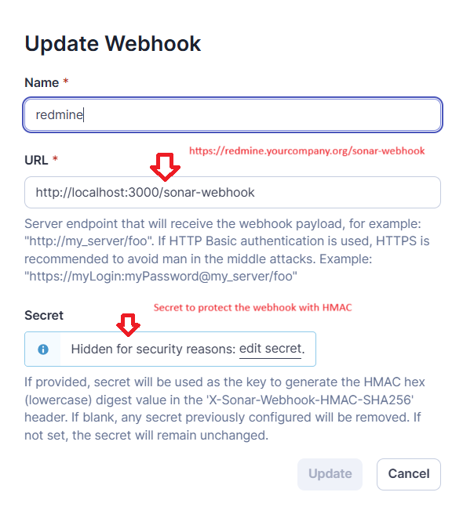
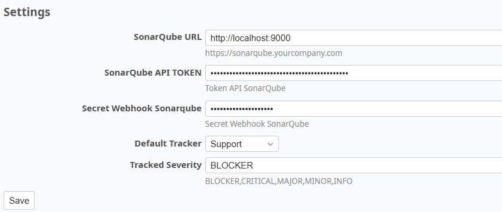

# Redmine sonarqube plugin
Redmine Plugin for SonarQube Webhooks &amp; Issue Sync

1.	SonarQube at the end of scanning invokes a WebHook ( HTTP Request in POST with PayLoad JSON that contains only the information about the scanned project)
2.	The receiver of the WebHook applies the necessary logic to process the payload after which it invokes the SonarQube API to extract the ISSUEs.
3.	Whoever invoked the SonarQube API opens the tickets on Redmine.

## Plugin Instructions

When the webhook is created in SonarQube, you must enter the URL of Redmine by concatenating `/sonar-webhook` (e.g., `https://redmine.yourcompany.org/sonar-webhook`).

You also need to create a secret to protect the webhook with HMAC.



The project key in Redmine must match the project key in SonarQube.

If the SonarQube author does not match the Redmine user, the default user (`admin`) will be assigned.

In the plugin configuration in Redmine, you need to enter the following parameters:

- `url`: SonarQube URL
- `user token`: Token API of SonarQube
- `secret`: Webhook secret in SonarQube
- `default tracker`
- `severity to track` (optional)



## Tested With Versions

- **Redmine**: `6.0.4`
- **Ruby**: `3.3.7`
- **Rails**: `7.2.2.1`

## Installation

### From a ZIP file:
1. Download the latest version of the plugin.
2. Unzip it to `/plugins`.

### From the Git repository:
1. Clone the repository:
   ```bash
   cd redmine/plugins
   git clone https://github.com/marcoserafini2/redmine_sonarqube_plugin.git